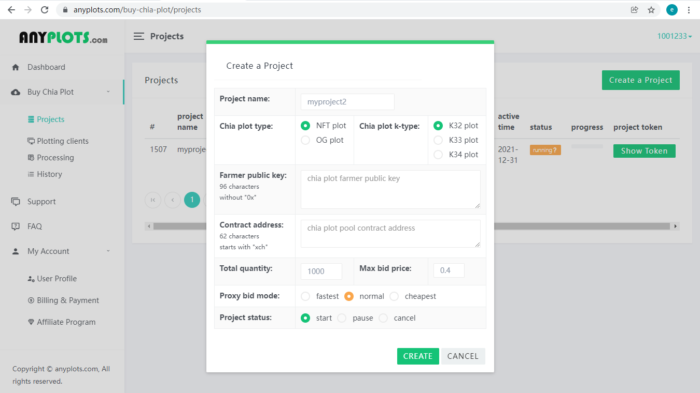

cloud chia plotter: fast chia plotting without SSD disk or large amount of memory.

It does not require SSD disk or large amount of memory, and can run well on low configuration rig, such as raspberry pi.

[https://anyplots.com/](https://anyplots.com) The marketplace to buy and sell chia plots, starts at $0.20/plot.

 
<h2>Cloud Chia Plotter Usage</h2>

<h3>Arguments:</h3>
<pre>
-p  project token ( get it from your project page https://anyplots.com/buy-chia-plot/projects ), such as(40 chars):
        -p 000005e13f5fc456753081edf7dcc98986dcffa15 

 
-d  directories for save plots, separate multiple directories with semicolons, such as:
        -d  /mnt/d/;/mnt/e/;/mnt/f/
        -d  d:\;e:\;f:\
     
-b  set your real network bandwidth/speed(Mbps), such as:
    for 500Mbps:    -b 500            , for 1000Mbps:    -b 1000  
    please test your network speed at <a href="https://speedtest.net" target="_blank">https://speedtest.net</a>
                
for example:

.\\CloudChiaPlotter.exe -p 000005e13f5fc456753081edf7dcc98986dcffa15 -d  "d:\\;e:\\;f:\\" -b 500

./CloudChiaPlotter -p 000005e13f5fc456753081edf7dcc98986dcffa15 -d  "/mnt/d/;/mnt/e/;/mnt/f/" -b 500

You can run multiple processes at the same time.

</pre>

<h3>Tips</h3>
<h4>Do not set bandwidth parameter that are inconsistent with your actual bandwidth, Please test your network speed at
<a href="https://speedtest.net" target="_blank">https://speedtest.net</a>
  If you set -b 1000 for the actual bandwidth of 500mbps, it will reduce your download speed in most cases, because the probability of network packet loss will increase.

</h4>
<h4>For bandwidth greater than 500mbps, two processes can be run at the same time, but the bandwidth parameter should be divided by 2.</h4>
<h4>Try to use the network cable to download. The wireless network is unstable and the download speed is affected.</h4>
<h4>Under the condition that the program does not change the directory configuration, for uncompleted plot, It will continue to transmit the remaining part only.</h4>

 
 

<h3>for Windows.</h3>
For beginners, we provide a simple GUI program. go <a href="windows-gui.md">Windows-GUI</a> 
  
If you are familiar with PowerShell, you can use the following scripts.
<pre>
#Run it on Windows
#Now, open a powershell window (Click Start, type PowerShell, and then click Windows PowerShell)
#run the follow command(If there is a problem with the execution sequence, please execute line by line)

#del .\\CloudChiaPlotter.exe

[Net.ServicePointManager]::SecurityProtocol = [Net.SecurityProtocolType]::Tls12
Invoke-WebRequest -Uri  https://github.com/anyplots/cloud-chia-plotter/releases/download/v3/cloud-chia-plotter-v3-win-x64.exe -Outfile .\\CloudChiaPlotter.exe
.\\CloudChiaPlotter.exe -p {your project token} -d  "d:\\;e:\\;f:\\" -b {your bandwidth}
</pre>

<h3>for Linux series.</h3>
<pre>
# run the follow script in the linux console
# Note that different platforms correspond to different link versions

#rm ./CloudChiaPlotter

wget -O CloudChiaPlotter https://github.com/anyplots/cloud-chia-plotter/releases/download/v3/cloud-chia-plotter-v3-linux-x64
chmod +x ./CloudChiaPlotter
./CloudChiaPlotter -p {your project token} -d  "/mnt/d/;/mnt/e/;/mnt/f/" -b {your bandwidth}
</pre>

<h3>for Mac OS series.</h3>
<pre>
#Running the CloudChiaPlotter on Mac OS
#Now, open a terminal window (Mac OS version of the command line)
#run the follow command:

#rm ./CloudChiaPlotter
curl  -LJ https://github.com/anyplots/cloud-chia-plotter/releases/download/v3/cloud-chia-plotter-v3-osx-x64 -o ./CloudChiaPlotter
chmod +x ./CloudChiaPlotter
./CloudChiaPlotter -p {your project token} -d  "/mnt/d/;/mnt/e/;/mnt/f/" -b {your bandwidth}
</pre>

<h3>for Arm64 Linux series(Raspberry Pi 3, Pi 4, etc)</h3>
<pre>
# run the follow script in the linux console
# Note that different platforms correspond to different link versions

#rm ./CloudChiaPlotter

wget -O CloudChiaPlotter https://github.com/anyplots/cloud-chia-plotter/releases/download/v3/cloud-chia-plotter-v3-linux-arm64
chmod +x ./CloudChiaPlotter
./CloudChiaPlotter -p {your project token} -d  "/mnt/d/;/mnt/e/;/mnt/f/" -b {your bandwidth}
</pre>

<h3>for Arm32 Linux  series.</h3>
<pre>
# run the follow script in the linux console
# Note that different platforms correspond to different link versions

#rm ./CloudChiaPlotter

wget -O CloudChiaPlotter https://github.com/anyplots/cloud-chia-plotter/releases/download/v3/cloud-chia-plotter-v3-linux-arm32
chmod +x ./CloudChiaPlotter
./CloudChiaPlotter -p {your project token} -d  "/mnt/d/;/mnt/e/;/mnt/f/" -b {your bandwidth}
</pre>

<h3>Tested download Speed</h3>
Different user experiences may vary, depending on your network and the plotting server you choose.
<pre>
download from U.S. based plotting server at the following countries(bandwidth 1 Gbit/s):
US: ping latency ~50ms,  download speed > 1000Mbit/s, ~ 13 minutes per plot.
UK: ping latency ~80ms,  download speed > 1000Mbit/s. ~ 13 minutes per plot.    
DE: ping latency ~100ms, download speed > 1000Mbit/s. ~ 13 minutes per plot.    
FR: ping latency ~100ms, download speed > 1000Mbit/s. ~ 13 minutes per plot.    
JP: ping latency ~160ms, download speed > 900Mbit/s.  ~ 15 minutes per plot.  
AU: ping latency ~220ms, download speed > 800Mbit/s.  ~ 16 minutes per plot.  
IN: ping latency ~280ms, download speed > 700Mbit/s.  ~ 18 minutes per plot.  

</pre>

<h2>How to build it from source code?</h2>
  
As this project is based on <b>Microsoft .NET 6.0</b>(more information https://dotnet.microsoft.com/en-us/download/dotnet/6.0) 
You can use <b>Microsoft Visual Studio 2022</b> to quickly compile various system versions  

We have precompiled some executable files for several common OS(see here https://github.com/anyplots/cloud-chia-plotter/releases).  
the compile configuration files is located  "Properties/PublishProfiles/" 
linux-arm.pubxml 
linux-arm64.pubxml 
linux-x64.pubxml 
osx-x64.pubxml 
win-x64.pubxml  

You also can compile it for other OS by yourself. 
<b>It is not recommended to change the business logic in the code, otherwise you may not be able to download or occurs unknown errors.</b>

