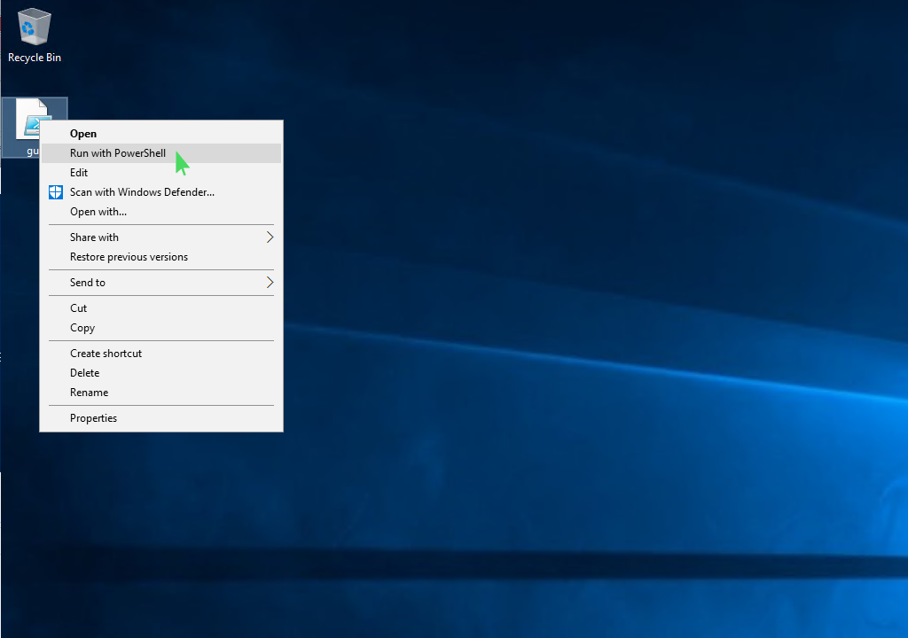
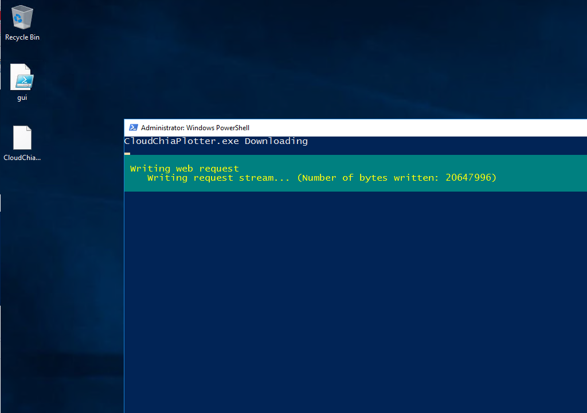
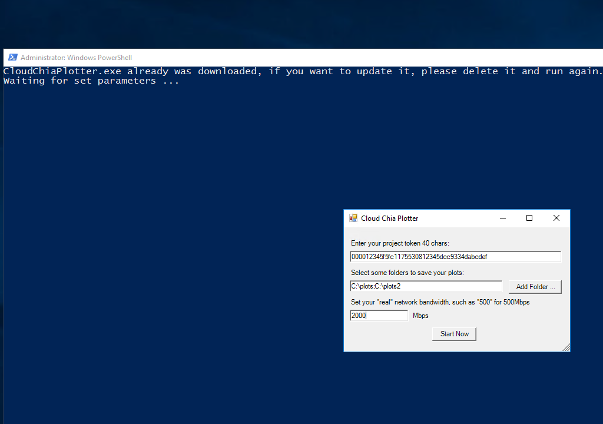
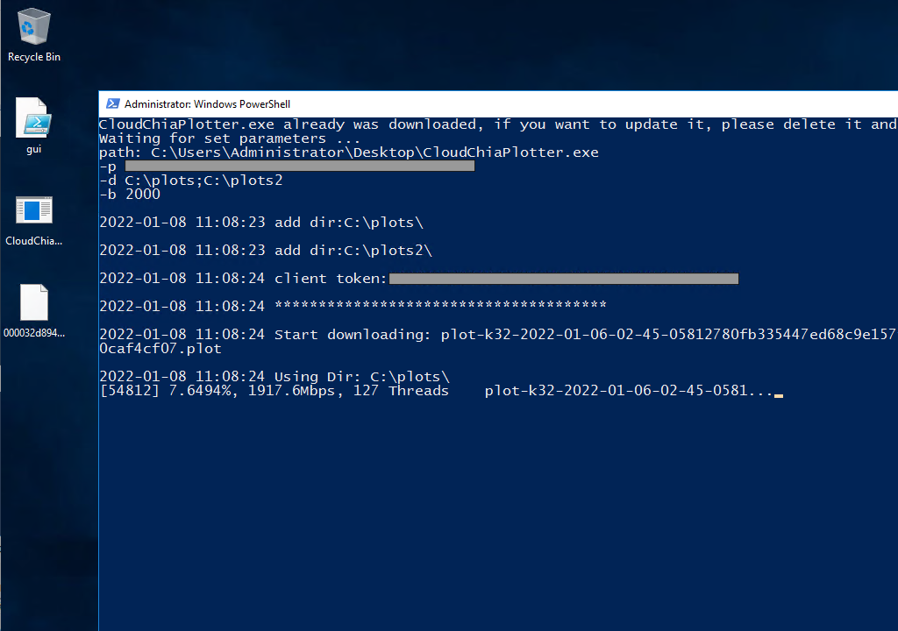

A PowerShell script GUI for windows series, download it at <a href="https://github.com/anyplots/cloud-chia-plotter/releases/download/v3/gui.ps1">https://github.com/anyplots/cloud-chia-plotter/releases/download/v3/gui.ps1</a>
  
How to run the gui.ps1? see the following screen: right click it, it will show the right menu, then click the "Run with PowerShell" option.

  
When it starting, it will auto download the CloudChiaPlotter.exe

  
After download the CloudChiaPlotter.exe, it will show a setup window, setup it with your own parameters.

  
Now, It's running,  It will auto download all plot related to your project, just keep it running.

  
